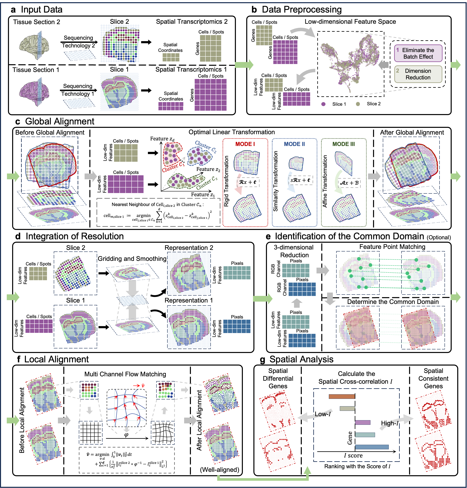

# CODA
## Integrative cross-sample alignment and spatially differential gene analysis for spatial transcriptomics
Our preprint **"Integrative cross-sample alignment and spatially differential gene analysis for spatial transcriptomics"** is now available on **bioRxiv**. 
Read the full preprint here: [https://www.biorxiv.org/content/10.1101/2025.06.05.653933](https://www.biorxiv.org/content/10.1101/2025.06.05.653933)

### What CODA does?

CODA is a computational framework designed for nonlinear alignment and spatial analysis across multiple spatial transcriptomics (ST) datasets. It jointly addresses spatial misalignment and spatial gene variation via:

* **Two-stage alignment:** global (**Mode I** rigid / **Mode II** similarity / **Mode III** weak-affine) followed by local diffeomorphic refinement (**LDDMM**).
* **Common-domain identification:** transformer-assisted keypoint/domain matching to restrict comparisons to biologically comparable regions.
* **Cross-sample spatial cross-correlation index :** detects spatially consistent genes (**SCGs**) and spatially differential genes (**SDGs**).

CODA supports cross-platform data (e.g., 10x Visium, MERFISH) and provides efficient, scalable alignment and analysis across replicates, technologies, and conditions. It also includes **3D reconstruction** for serial sections.

### Overview of CODA


## Requirements and Installation
[](https://www.python.org/)
[](https://pypi.org/project/numpy/)
[](https://pypi.org/project/pandas/)
[](https://pypi.org/project/scipy/)
[](https://pypi.org/project/matplotlib/)
[](https://pypi.org/project/Pillow/)
[](https://pypi.org/project/scikit-image/)
[](https://pypi.org/project/opencv-python/)
[](https://pypi.org/project/anndata/)
[](https://pypi.org/project/scanpy/)
[](https://pypi.org/project/bbknn/)
[](https://pypi.org/project/shapely/)
[](https://pypi.org/project/louvain/)
[](https://pypi.org/project/kornia/)
[](https://pytorch.org/)
[](https://pytorch.org/)


### Create and activate Python environment
It is recommended to create a virtual environment for using CODA to avoid any conflicts with existing Python installations. You can create a virtual environment using Anaconda:
```bash
conda create -n CODA-env python=3.9
conda activate CODA-env
```

### Install PyTorch with CUDA 11.8 support

CODA was developed and tested with **PyTorch 2.4.0 + CUDA 11.8**.
To ensure compatibility and performance, please follow the steps below to install PyTorch:

```bash
# Step 1: Install CUDA 11.8 runtime (if not already installed)
conda install cudatoolkit=11.8 -c pytorch

# Step 2: Install PyTorch with CUDA 11.8 support
pip3 install torch torchvision torchaudio --index-url https://download.pytorch.org/whl/cu118
```

> ✅ Note: This ensures you install the GPU version of PyTorch for CUDA 11.8.
>
> ❗️If you are using a CPU-only machine, replace the second line with:
>
> ```bash
> pip install torch torchvision torchaudio
> ```

Note: This is just an example. Please refer to the PyTorch website for the command that matches your system's specific requirements.

### Install CODA

To install CODA, simply use pip with the following command:

```bash
pip install icoda == 2.0.0
```

This command will download and install the CODA package from PyPI, making it ready to use in your Python environment.

To install the dependencies, run the following command:

```bash
pip install -r requirements.txt
```

## Development Status & Tutorials

**Major update (2025-10-31, UTC+8):** CODA is fully upgraded — the PyPI package is now **`icoda` v2.0.0**.

### What’s new in 2.0.0
1. Cleaner, more user-friendly APIs and utilities.
2. Overhauled **global alignment** with better accuracy and three modes:
   - **G1** (rigid), **G2** (similarity), **G2+** (weak-affine).
3. Built-in **3D reconstruction** for serial sections.
4. Interoperation with **STAligner** (load its `.h5ad` outputs and align with CODA).
5. Five **rewritten tutorials** (T1–T5) with runnable notebooks and sample-data links.


### Tutorials

* **T1**: Quickstart & reproducibility (end-to-end alignment + spatial analysis)
* **T2**: Calculation of spatial cross-correlation index
* **T3**: 3D reconstruction from serial sections
* **T4**: Global alignment modes (when to use G1 / G2 / G2+)
* **T5**: Using **STAligner** outputs with CODA

> Each tutorial notebook includes a **sample-data link** at the top.

### Contact

Feedback and bug reports are welcome. **Email is preferred:** `yctan21@m.fudan.edu.cn`
(GitHub Issues may not be monitored immediately.)

**Note on preprint:** We will update our preprint to reflect v2.0.0 changes at an appropriate time.

