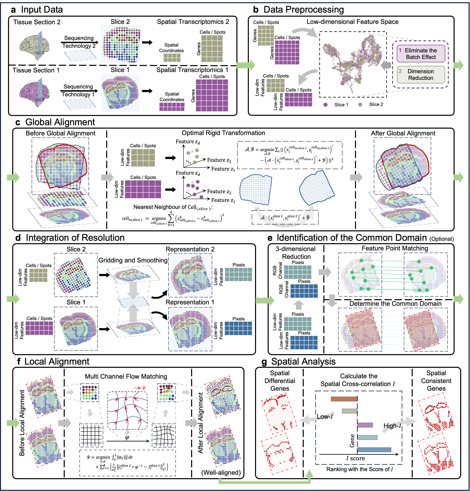

# CODA
## Integrative cross-sample alignment and spatially differential gene analysis for spatial transcriptomics
CODA is a computational framework designed for nonlinear alignment and spatial analysis across multiple spatial transcriptomics (ST) datasets. CODA simultaneously addresses the challenges of spatial misalignment and spatial gene variation by introducing:

- Global rigid and local nonlinear alignment using a two-stage strategy
- Common domain identification through transformer-based keypoint matching
- A spatial cross-correlation metric to detect spatially consistent genes (SCGs) and spatially differential genes (SDGs)

CODA supports cross-platform datasets (e.g., 10X Visium, MERFISH) and enables efficient and scalable alignment and analysis across biological replicates, technologies, and conditions.

### Overview of CODA

## Requirements and Installation

